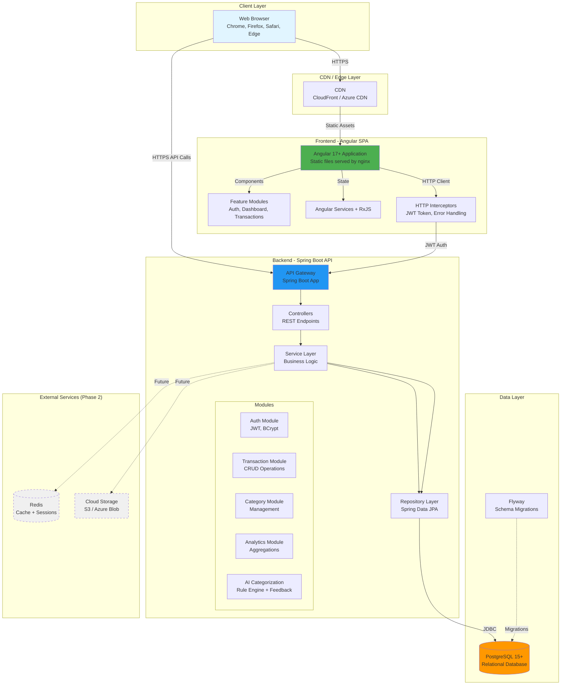
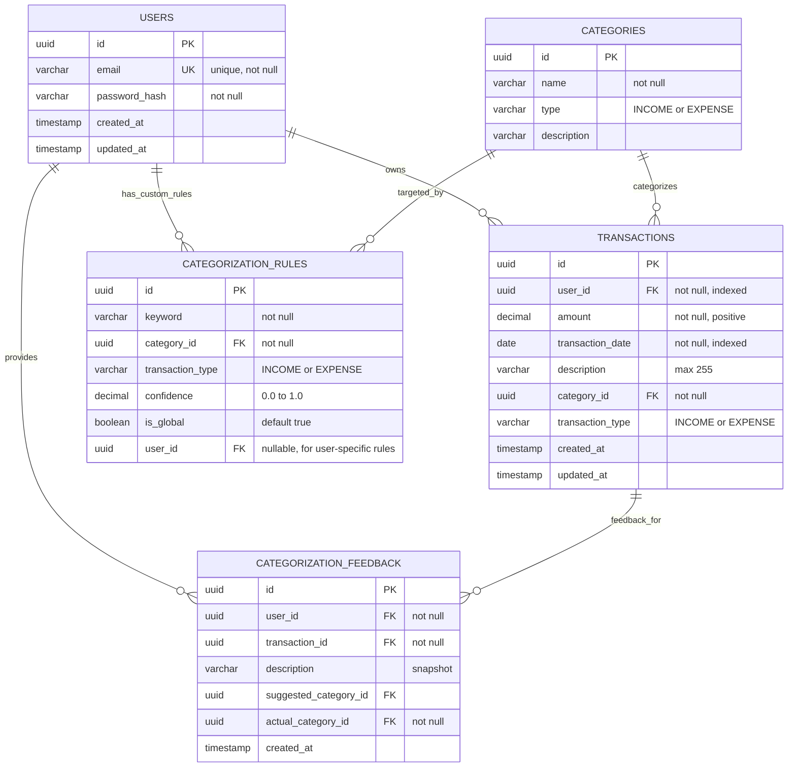
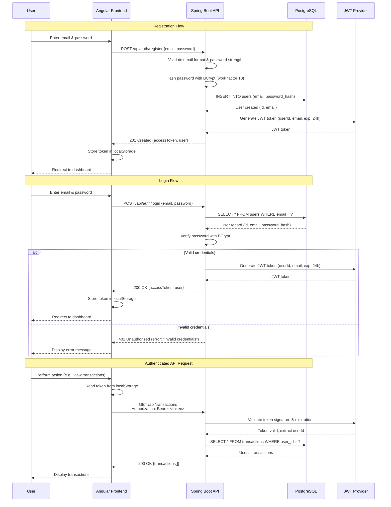

# Smart Budget App - Full-Stack Architecture

## Introduction

This document outlines the complete full-stack architecture for the Smart Budget App, including backend systems, frontend implementation, and their integration. It serves as the single source of truth for AI-driven development, ensuring consistency across the entire technology stack.

This unified approach combines what would traditionally be separate backend and frontend architecture documents, streamlining the development process for modern full-stack applications where these concerns are increasingly intertwined.

### Starter Template or Existing Project

**Status:** Greenfield project - built from scratch

No starter templates are used. The project is built using standard Angular CLI (`ng new`) and Spring Initializr for Spring Boot, with custom configuration to match our specific architectural needs.

### Change Log

| Date | Version | Description | Author |
|------|---------|-------------|--------|
| 2025-11-11 | 1.0 | Initial architecture document created | Winston (Architect) |

## High-Level Architecture

### Technical Summary

The Smart Budget App employs a **traditional client-server architecture** with an Angular 17+ Single Page Application (SPA) frontend communicating with a Spring Boot 3.x REST API backend. The frontend is deployed as static files served by nginx, while the backend runs as a containerized Java application. Both tiers communicate over HTTPS with JWT-based stateless authentication. The application uses PostgreSQL 15+ as the primary data store with Flyway for schema versioning. The entire stack is containerized using Docker, with Docker Compose orchestrating local development (frontend, backend, database). CI/CD is handled through GitHub Actions, automating testing, building, and deployment to cloud infrastructure (AWS/Azure/GCP - to be determined based on cost and requirements). This architecture achieves the PRD goals of rapid development (BMAD methodology), security (JWT auth, encrypted data), scalability (stateless API, horizontal scaling potential), and maintainability (clear separation of concerns, automated testing).

### Platform and Infrastructure Choice

After evaluating several options, the recommended platform is:

**Platform:** Cloud-agnostic with Docker containers (deployable to AWS, Azure, or GCP)

**Key Services:**
- **Compute:** Container hosting (AWS ECS/Fargate, Azure Container Instances, or GCP Cloud Run)
- **Database:** Managed PostgreSQL (AWS RDS, Azure Database for PostgreSQL, or GCP Cloud SQL)
- **Storage:** Cloud object storage for future file uploads (AWS S3, Azure Blob, or GCP Cloud Storage) - Phase 2
- **CDN:** CloudFront (AWS), Azure CDN, or Cloud CDN (GCP) for frontend static assets
- **Secrets Management:** AWS Secrets Manager, Azure Key Vault, or GCP Secret Manager
- **Monitoring:** Cloud-native monitoring (CloudWatch, Azure Monitor, or Cloud Monitoring)

**Deployment Host and Regions:**
- **MVP:** Single region deployment (US-East for lower latency to target users)
- **Phase 2:** Multi-region consideration for disaster recovery

**Rationale:**
- **Cloud-agnostic:** Avoid vendor lock-in by using Docker containers and standard PostgreSQL
- **Managed services:** Reduce operational overhead (managed database, auto-scaling containers)
- **Cost-effective:** Start with free tiers and scale as needed
- **Modern tooling:** Leverage cloud-native CI/CD integration with GitHub Actions

### Repository Structure

**Structure:** Monorepo

**Monorepo Tool:** None (simple directory-based monorepo)

**Package Organization:**
- `frontend/` - Angular 17+ application (standalone directory)
- `backend/` - Spring Boot Java 21 application (standalone directory)
- `docs/` - BMAD documentation (PRD, architecture, specs)
- `.github/workflows/` - CI/CD pipelines for both applications
- `docker-compose.yml` - Local development orchestration

**Rationale:**
- Simple monorepo structure without additional tooling complexity (no Nx, Turborepo needed for this scope)
- Shared version control and coordinated releases
- Single CI/CD pipeline can build, test, and deploy both applications
- Developer convenience: single clone, single workspace

### High-Level Architecture Diagram



### Architectural Patterns

- **Client-Server Architecture:** Clear separation between frontend (Angular SPA) and backend (Spring Boot API) with REST as the communication protocol - _Rationale:_ Enables independent development, testing, and scaling of each tier; widely understood pattern with extensive tooling support

- **Layered Architecture (Backend):** Controller → Service → Repository pattern with clear separation of concerns - _Rationale:_ Promotes maintainability, testability (mock layers independently), and enforces business logic encapsulation in service layer

- **Component-Based UI (Frontend):** Reusable Angular components organized into feature modules with lazy loading - _Rationale:_ Improves code reusability, enables code splitting for faster initial load, and maintains clear feature boundaries

- **Repository Pattern:** Data access abstraction via Spring Data JPA repositories - _Rationale:_ Decouples business logic from data access implementation, enables easy testing with mocks, and provides consistent CRUD operations

- **Service Layer Pattern:** Business logic encapsulated in service classes with transaction management - _Rationale:_ Centralizes business rules, provides transaction boundaries, and prevents business logic leakage into controllers or repositories

- **Interceptor Pattern:** HTTP interceptors for cross-cutting concerns (authentication tokens, error handling, logging) - _Rationale:_ Avoids code duplication, provides centralized request/response modification, and separates cross-cutting concerns from business logic

- **DTO Pattern:** Separate Data Transfer Objects for API request/response to decouple API contracts from domain models - _Rationale:_ Prevents domain model exposure, allows API evolution without database changes, and provides clear API contracts

- **Stateless Authentication:** JWT tokens for authentication without server-side session storage - _Rationale:_ Enables horizontal scaling (no session affinity), reduces server memory usage, and simplifies deployment

## Tech Stack

The complete technology stack is documented in **[docs/architecture/tech-stack.md](architecture/tech-stack.md)**.

**Key Technologies:**
- **Frontend:** Angular 17+, TypeScript, Angular Material + Tailwind CSS, Chart.js
- **Backend:** Java 21, Spring Boot 3.2+, Spring Data JPA, Hibernate
- **Database:** PostgreSQL 15+, Flyway migrations
- **Build Tools:** Angular CLI, Gradle 8+
- **Testing:** Jasmine/Karma (frontend), JUnit 5/Mockito (backend), TestContainers (integration)
- **Containerization:** Docker, Docker Compose
- **CI/CD:** GitHub Actions

Refer to tech-stack.md for complete rationale, versions, and technology decisions.

## Data Models

### User

**Purpose:** Represents a registered user account with authentication credentials and profile information.

**Key Attributes:**
- `id`: UUID - Unique identifier (primary key)
- `email`: String - User's email address (unique, used for login)
- `passwordHash`: String - BCrypt hashed password (never returned in API responses)
- `createdAt`: Timestamp - Account creation date
- `updatedAt`: Timestamp - Last profile update date

#### TypeScript Interface

```typescript
export interface User {
  id: string;
  email: string;
  // passwordHash intentionally excluded from frontend interface
  createdAt: Date;
  updatedAt: Date;
}

export interface UserProfile extends User {
  // Future extensions: name, avatar, preferences
}
```

#### Relationships

- One-to-many with Transaction (one user has many transactions)
- One-to-many with CategorizationFeedback (one user provides many feedback entries)

### Transaction

**Purpose:** Represents a single financial transaction (income or expense) recorded by a user.

**Key Attributes:**
- `id`: UUID - Unique identifier (primary key)
- `userId`: UUID - Foreign key to User (owner of transaction)
- `amount`: Decimal - Transaction amount (positive for both income and expenses)
- `transactionDate`: Date - Date of the transaction
- `description`: String - User-provided description (max 255 characters)
- `categoryId`: UUID - Foreign key to Category
- `transactionType`: Enum - INCOME or EXPENSE
- `createdAt`: Timestamp - Record creation date
- `updatedAt`: Timestamp - Last modification date

#### TypeScript Interface

```typescript
export enum TransactionType {
  INCOME = 'INCOME',
  EXPENSE = 'EXPENSE'
}

export interface Transaction {
  id: string;
  userId: string;
  amount: number;
  transactionDate: Date;
  description: string;
  category: Category; // Nested object
  transactionType: TransactionType;
  createdAt: Date;
  updatedAt: Date;
}

export interface TransactionRequest {
  amount: number;
  transactionDate: string; // ISO 8601 date string
  description: string;
  categoryId: string;
  transactionType: TransactionType;
}
```

#### Relationships

- Many-to-one with User (many transactions belong to one user)
- Many-to-one with Category (many transactions have one category)
- One-to-many with CategorizationFeedback (one transaction may have feedback entries)

### Category

**Purpose:** Represents a predefined category for transaction classification (e.g., Rent, Food, Salary).

**Key Attributes:**
- `id`: UUID - Unique identifier (primary key)
- `name`: String - Category name (e.g., "Food", "Rent", "Salary")
- `type`: Enum - INCOME or EXPENSE (determines if category applies to income or expenses)
- `description`: String - Optional description of the category

#### TypeScript Interface

```typescript
export enum CategoryType {
  INCOME = 'INCOME',
  EXPENSE = 'EXPENSE'
}

export interface Category {
  id: string;
  name: string;
  type: CategoryType;
  description?: string;
}
```

#### Relationships

- One-to-many with Transaction (one category used by many transactions)
- One-to-many with CategorizationRule (one category targeted by many rules)

### CategorizationRule

**Purpose:** Represents a rule for AI-powered transaction categorization based on keywords and patterns.

**Key Attributes:**
- `id`: UUID - Unique identifier (primary key)
- `keyword`: String - Keyword or regex pattern to match in transaction description
- `categoryId`: UUID - Foreign key to Category (suggested category)
- `transactionType`: Enum - INCOME or EXPENSE (rule applies to this type)
- `confidence`: Decimal - Confidence score (0.0 to 1.0) for this rule
- `isGlobal`: Boolean - True for system-wide rules, false for user-specific rules
- `userId`: UUID - Foreign key to User (null for global rules, set for user-specific rules)

#### TypeScript Interface

```typescript
export interface CategorizationRule {
  id: string;
  keyword: string;
  categoryId: string;
  transactionType: TransactionType;
  confidence: number; // 0.0 to 1.0
  isGlobal: boolean;
  userId?: string; // Optional, only for user-specific rules
}
```

#### Relationships

- Many-to-one with Category (many rules suggest one category)
- Many-to-one with User (many user-specific rules belong to one user)

### CategorizationFeedback

**Purpose:** Tracks user corrections to AI category suggestions to enable personalized learning.

**Key Attributes:**
- `id`: UUID - Unique identifier (primary key)
- `userId`: UUID - Foreign key to User (who provided feedback)
- `transactionId`: UUID - Foreign key to Transaction (which transaction was corrected)
- `description`: String - Transaction description at time of feedback
- `suggestedCategoryId`: UUID - Category suggested by AI
- `actualCategoryId`: UUID - Category chosen by user (correction)
- `createdAt`: Timestamp - When feedback was recorded

#### TypeScript Interface

```typescript
export interface CategorizationFeedback {
  id: string;
  userId: string;
  transactionId: string;
  description: string;
  suggestedCategoryId: string;
  actualCategoryId: string;
  createdAt: Date;
}
```

#### Relationships

- Many-to-one with User (many feedback entries from one user)
- Many-to-one with Transaction (feedback references one transaction)
- References two Category records (suggested and actual)

## API Specification

The Smart Budget App uses **REST API** following OpenAPI 3.0 specification.

### Base URL

- **Development:** `http://localhost:8080/api`
- **Staging:** `https://staging-api.smartbudgetapp.com/api`
- **Production:** `https://api.smartbudgetapp.com/api`

### Authentication

All endpoints except `/auth/login` and `/auth/register` require a valid JWT token in the `Authorization` header:

```
Authorization: Bearer <jwt_token>
```

### Endpoint Summary

| Method | Endpoint | Description | Auth Required |
|--------|----------|-------------|---------------|
| POST | `/auth/register` | Register new user account | No |
| POST | `/auth/login` | Login and receive JWT token | No |
| GET | `/transactions` | List all user transactions (filtered, sorted, paginated) | Yes |
| GET | `/transactions/{id}` | Get single transaction by ID | Yes |
| POST | `/transactions` | Create new transaction | Yes |
| PUT | `/transactions/{id}` | Update existing transaction | Yes |
| DELETE | `/transactions/{id}` | Delete transaction | Yes |
| POST | `/transactions/bulk-categorize` | Apply AI categorization to multiple transactions | Yes |
| GET | `/categories` | List all categories | Yes |
| POST | `/categorization/suggest` | Get AI category suggestion for transaction description | Yes |
| GET | `/analytics/summary` | Get financial summary (income, expenses, balance) | Yes |
| GET | `/analytics/category-breakdown` | Get spending breakdown by category | Yes |
| GET | `/analytics/trends` | Get spending trends over time | Yes |
| GET | `/users/profile` | Get current user profile | Yes |
| PUT | `/users/profile` | Update user profile | Yes |
| PUT | `/users/password` | Change user password | Yes |

### OpenAPI 3.0 Specification (Excerpt)

```yaml
openapi: 3.0.0
info:
  title: Smart Budget App API
  version: 1.0.0
  description: REST API for Smart Budget App - personal finance management
servers:
  - url: http://localhost:8080/api
    description: Development server
  - url: https://api.smartbudgetapp.com/api
    description: Production server

paths:
  /auth/register:
    post:
      tags: [Authentication]
      summary: Register new user
      requestBody:
        required: true
        content:
          application/json:
            schema:
              type: object
              required: [email, password]
              properties:
                email:
                  type: string
                  format: email
                  example: user@example.com
                password:
                  type: string
                  format: password
                  minLength: 8
                  example: SecurePass123
      responses:
        '201':
          description: User created successfully
          content:
            application/json:
              schema:
                $ref: '#/components/schemas/AuthResponse'
        '400':
          description: Validation error (invalid email, weak password, email already exists)

  /auth/login:
    post:
      tags: [Authentication]
      summary: Login and receive JWT token
      requestBody:
        required: true
        content:
          application/json:
            schema:
              type: object
              required: [email, password]
              properties:
                email:
                  type: string
                  format: email
                password:
                  type: string
                  format: password
      responses:
        '200':
          description: Login successful
          content:
            application/json:
              schema:
                $ref: '#/components/schemas/AuthResponse'
        '401':
          description: Invalid credentials

  /transactions:
    get:
      tags: [Transactions]
      summary: List user transactions
      security:
        - BearerAuth: []
      parameters:
        - name: page
          in: query
          schema:
            type: integer
            default: 0
        - name: size
          in: query
          schema:
            type: integer
            default: 20
        - name: sortBy
          in: query
          schema:
            type: string
            enum: [transactionDate, amount, createdAt]
            default: transactionDate
        - name: sortDirection
          in: query
          schema:
            type: string
            enum: [asc, desc]
            default: desc
        - name: dateFrom
          in: query
          schema:
            type: string
            format: date
        - name: dateTo
          in: query
          schema:
            type: string
            format: date
        - name: categoryId
          in: query
          schema:
            type: string
            format: uuid
        - name: transactionType
          in: query
          schema:
            type: string
            enum: [INCOME, EXPENSE]
      responses:
        '200':
          description: List of transactions
          content:
            application/json:
              schema:
                type: object
                properties:
                  content:
                    type: array
                    items:
                      $ref: '#/components/schemas/TransactionResponse'
                  totalElements:
                    type: integer
                  totalPages:
                    type: integer
                  page:
                    type: integer
                  size:
                    type: integer

    post:
      tags: [Transactions]
      summary: Create new transaction
      security:
        - BearerAuth: []
      requestBody:
        required: true
        content:
          application/json:
            schema:
              $ref: '#/components/schemas/TransactionRequest'
      responses:
        '201':
          description: Transaction created
          content:
            application/json:
              schema:
                $ref: '#/components/schemas/TransactionResponse'
        '400':
          description: Validation error

  /transactions/{id}:
    get:
      tags: [Transactions]
      summary: Get transaction by ID
      security:
        - BearerAuth: []
      parameters:
        - name: id
          in: path
          required: true
          schema:
            type: string
            format: uuid
      responses:
        '200':
          description: Transaction details
          content:
            application/json:
              schema:
                $ref: '#/components/schemas/TransactionResponse'
        '404':
          description: Transaction not found
        '403':
          description: Unauthorized (transaction belongs to another user)

    put:
      tags: [Transactions]
      summary: Update transaction
      security:
        - BearerAuth: []
      parameters:
        - name: id
          in: path
          required: true
          schema:
            type: string
            format: uuid
      requestBody:
        required: true
        content:
          application/json:
            schema:
              $ref: '#/components/schemas/TransactionRequest'
      responses:
        '200':
          description: Transaction updated
          content:
            application/json:
              schema:
                $ref: '#/components/schemas/TransactionResponse'

    delete:
      tags: [Transactions]
      summary: Delete transaction
      security:
        - BearerAuth: []
      parameters:
        - name: id
          in: path
          required: true
          schema:
            type: string
            format: uuid
      responses:
        '204':
          description: Transaction deleted successfully
        '404':
          description: Transaction not found

components:
  schemas:
    AuthResponse:
      type: object
      properties:
        accessToken:
          type: string
          description: JWT access token (valid for 24 hours)
        user:
          type: object
          properties:
            id:
              type: string
              format: uuid
            email:
              type: string
              format: email

    TransactionRequest:
      type: object
      required: [amount, transactionDate, description, categoryId, transactionType]
      properties:
        amount:
          type: number
          format: decimal
          minimum: 0.01
          example: 49.99
        transactionDate:
          type: string
          format: date
          example: "2025-01-15"
        description:
          type: string
          maxLength: 255
          example: "Grocery shopping at Whole Foods"
        categoryId:
          type: string
          format: uuid
        transactionType:
          type: string
          enum: [INCOME, EXPENSE]
          example: EXPENSE
        suggestedCategoryId:
          type: string
          format: uuid
          description: Optional - for feedback tracking if AI suggested different category

    TransactionResponse:
      type: object
      properties:
        id:
          type: string
          format: uuid
        amount:
          type: number
          format: decimal
        transactionDate:
          type: string
          format: date
        description:
          type: string
        category:
          $ref: '#/components/schemas/Category'
        transactionType:
          type: string
          enum: [INCOME, EXPENSE]
        createdAt:
          type: string
          format: date-time
        updatedAt:
          type: string
          format: date-time

    Category:
      type: object
      properties:
        id:
          type: string
          format: uuid
        name:
          type: string
          example: "Food"
        type:
          type: string
          enum: [INCOME, EXPENSE]
        description:
          type: string

  securitySchemes:
    BearerAuth:
      type: http
      scheme: bearer
      bearerFormat: JWT
```

**Full OpenAPI specification:** Available at `/api/swagger-ui.html` (Springdoc OpenAPI UI)

## Database Schema

### Entity Relationship Diagram



### Flyway Migration Scripts

#### V1__initial_schema.sql

```sql
-- Create users table
CREATE TABLE users (
    id UUID PRIMARY KEY DEFAULT gen_random_uuid(),
    email VARCHAR(255) NOT NULL UNIQUE,
    password_hash VARCHAR(255) NOT NULL,
    created_at TIMESTAMP NOT NULL DEFAULT CURRENT_TIMESTAMP,
    updated_at TIMESTAMP NOT NULL DEFAULT CURRENT_TIMESTAMP
);

CREATE INDEX idx_users_email ON users(email);

-- Create categories table
CREATE TABLE categories (
    id UUID PRIMARY KEY DEFAULT gen_random_uuid(),
    name VARCHAR(100) NOT NULL,
    type VARCHAR(20) NOT NULL CHECK (type IN ('INCOME', 'EXPENSE')),
    description VARCHAR(500)
);

CREATE INDEX idx_categories_type ON categories(type);

-- Create transactions table
CREATE TABLE transactions (
    id UUID PRIMARY KEY DEFAULT gen_random_uuid(),
    user_id UUID NOT NULL REFERENCES users(id) ON DELETE CASCADE,
    amount DECIMAL(15, 2) NOT NULL CHECK (amount > 0),
    transaction_date DATE NOT NULL,
    description VARCHAR(255) NOT NULL,
    category_id UUID NOT NULL REFERENCES categories(id),
    transaction_type VARCHAR(20) NOT NULL CHECK (transaction_type IN ('INCOME', 'EXPENSE')),
    created_at TIMESTAMP NOT NULL DEFAULT CURRENT_TIMESTAMP,
    updated_at TIMESTAMP NOT NULL DEFAULT CURRENT_TIMESTAMP
);

CREATE INDEX idx_transactions_user_id ON transactions(user_id);
CREATE INDEX idx_transactions_date ON transactions(transaction_date);
CREATE INDEX idx_transactions_category_id ON transactions(category_id);
CREATE INDEX idx_transactions_type ON transactions(transaction_type);
```

#### V2__seed_categories.sql

```sql
-- Seed income categories
INSERT INTO categories (id, name, type, description) VALUES
    (gen_random_uuid(), 'Salary', 'INCOME', 'Regular employment income'),
    (gen_random_uuid(), 'Freelance', 'INCOME', 'Freelance or contract work'),
    (gen_random_uuid(), 'Investments', 'INCOME', 'Investment returns, dividends'),
    (gen_random_uuid(), 'Other Income', 'INCOME', 'Other sources of income');

-- Seed expense categories
INSERT INTO categories (id, name, type, description) VALUES
    (gen_random_uuid(), 'Rent', 'EXPENSE', 'Housing rent or mortgage'),
    (gen_random_uuid(), 'Food', 'EXPENSE', 'Groceries and dining'),
    (gen_random_uuid(), 'Transport', 'EXPENSE', 'Transportation costs (gas, transit, uber)'),
    (gen_random_uuid(), 'Entertainment', 'EXPENSE', 'Movies, games, hobbies'),
    (gen_random_uuid(), 'Utilities', 'EXPENSE', 'Electricity, water, internet, phone'),
    (gen_random_uuid(), 'Healthcare', 'EXPENSE', 'Medical expenses, insurance'),
    (gen_random_uuid(), 'Shopping', 'EXPENSE', 'Clothing, electronics, general shopping'),
    (gen_random_uuid(), 'Savings', 'EXPENSE', 'Transfers to savings accounts'),
    (gen_random_uuid(), 'Other Expense', 'EXPENSE', 'Miscellaneous expenses');
```

#### V3__categorization_tables.sql

```sql
-- Create categorization rules table (for AI suggestions)
CREATE TABLE categorization_rules (
    id UUID PRIMARY KEY DEFAULT gen_random_uuid(),
    keyword VARCHAR(255) NOT NULL,
    category_id UUID NOT NULL REFERENCES categories(id),
    transaction_type VARCHAR(20) NOT NULL CHECK (transaction_type IN ('INCOME', 'EXPENSE')),
    confidence DECIMAL(3, 2) NOT NULL CHECK (confidence BETWEEN 0.00 AND 1.00),
    is_global BOOLEAN NOT NULL DEFAULT TRUE,
    user_id UUID REFERENCES users(id) ON DELETE CASCADE
);

CREATE INDEX idx_categorization_rules_keyword ON categorization_rules(keyword);
CREATE INDEX idx_categorization_rules_user_id ON categorization_rules(user_id);
CREATE INDEX idx_categorization_rules_global ON categorization_rules(is_global);

-- Create categorization feedback table (user corrections for learning)
CREATE TABLE categorization_feedback (
    id UUID PRIMARY KEY DEFAULT gen_random_uuid(),
    user_id UUID NOT NULL REFERENCES users(id) ON DELETE CASCADE,
    transaction_id UUID NOT NULL REFERENCES transactions(id) ON DELETE CASCADE,
    description VARCHAR(255) NOT NULL,
    suggested_category_id UUID REFERENCES categories(id),
    actual_category_id UUID NOT NULL REFERENCES categories(id),
    created_at TIMESTAMP NOT NULL DEFAULT CURRENT_TIMESTAMP
);

CREATE INDEX idx_feedback_user_id ON categorization_feedback(user_id);
CREATE INDEX idx_feedback_transaction_id ON categorization_feedback(transaction_id);
CREATE INDEX idx_feedback_description ON categorization_feedback(description);

-- Seed initial global categorization rules
INSERT INTO categorization_rules (keyword, category_id, transaction_type, confidence, is_global)
SELECT 'starbucks', id, 'EXPENSE', 0.85, TRUE FROM categories WHERE name = 'Food';
INSERT INTO categorization_rules (keyword, category_id, transaction_type, confidence, is_global)
SELECT 'grocery', id, 'EXPENSE', 0.90, TRUE FROM categories WHERE name = 'Food';
INSERT INTO categorization_rules (keyword, category_id, transaction_type, confidence, is_global)
SELECT 'uber', id, 'EXPENSE', 0.85, TRUE FROM categories WHERE name = 'Transport';
INSERT INTO categorization_rules (keyword, category_id, transaction_type, confidence, is_global)
SELECT 'netflix', id, 'EXPENSE', 0.90, TRUE FROM categories WHERE name = 'Entertainment';
INSERT INTO categorization_rules (keyword, category_id, transaction_type, confidence, is_global)
SELECT 'salary', id, 'INCOME', 0.95, TRUE FROM categories WHERE name = 'Salary';
INSERT INTO categorization_rules (keyword, category_id, transaction_type, confidence, is_global)
SELECT 'paycheck', id, 'INCOME', 0.95, TRUE FROM categories WHERE name = 'Salary';
```

## Security Architecture

### Authentication Flow



### JWT Token Structure

```json
{
  "header": {
    "alg": "HS256",
    "typ": "JWT"
  },
  "payload": {
    "sub": "user-uuid-here",
    "email": "user@example.com",
    "iat": 1699564800,
    "exp": 1699651200
  },
  "signature": "..."
}
```

**Token Claims:**
- `sub` (Subject): User UUID
- `email`: User email address
- `iat` (Issued At): Token generation timestamp
- `exp` (Expiration): Token expiration (24 hours from `iat`)

### Security Measures

**Backend (Spring Boot):**
- **Password Hashing:** BCrypt with work factor 10 (configured in Spring Security)
- **JWT Signing:** HMAC-SHA256 with secret key from environment variable
- **CORS Configuration:** Whitelist frontend origin only (no wildcard `*`)
- **Input Validation:** Bean Validation (`@Valid`, `@NotNull`, `@Email`, etc.) on all request DTOs
- **SQL Injection Prevention:** Parameterized queries via JPA (no string concatenation)
- **Authorization:** All endpoints verify user ownership before returning/modifying data
- **HTTPS Enforcement:** All production traffic over TLS 1.2+
- **Security Headers:** Content-Security-Policy, X-Frame-Options, X-Content-Type-Options

**Frontend (Angular):**
- **Token Storage:** JWT stored in `localStorage` (XSS mitigation via Angular's built-in sanitization)
- **HTTP Interceptor:** Automatically attaches token to all outgoing requests
- **Error Interceptor:** Catches 401/403 responses, logs user out, redirects to login
- **Route Guards:** `AuthGuard` prevents access to protected routes without valid token
- **Input Sanitization:** Angular's DomSanitizer prevents XSS in dynamic content
- **CSP Headers:** Content-Security-Policy header blocks inline scripts

## Deployment Architecture

### Containerization

**Frontend (Dockerfile.frontend):**
```dockerfile
# Build stage
FROM node:20-alpine AS build
WORKDIR /app
COPY frontend/package*.json ./
RUN npm ci
COPY frontend/ ./
RUN npm run build -- --configuration production

# Production stage
FROM nginx:alpine
COPY --from=build /app/dist/browser /usr/share/nginx/html
COPY nginx.conf /etc/nginx/nginx.conf
EXPOSE 80
CMD ["nginx", "-g", "daemon off;"]
```

**Backend (Dockerfile.backend):**
```dockerfile
# Build stage
FROM gradle:8.5-jdk21 AS build
WORKDIR /app
COPY backend/build.gradle backend/settings.gradle ./
COPY backend/gradle ./gradle
COPY backend/src ./src
RUN gradle build -x test --no-daemon

# Production stage
FROM eclipse-temurin:21-jre-alpine
WORKDIR /app
COPY --from=build /app/build/libs/*.jar app.jar
EXPOSE 8080
ENTRYPOINT ["java", "-jar", "app.jar"]
```

### Local Development (docker-compose.yml)

```yaml
version: '3.8'

services:
  postgres:
    image: postgres:15-alpine
    environment:
      POSTGRES_DB: smartbudget
      POSTGRES_USER: postgres
      POSTGRES_PASSWORD: postgres
    ports:
      - "5432:5432"
    volumes:
      - postgres_data:/var/lib/postgresql/data
    healthcheck:
      test: ["CMD-SHELL", "pg_isready -U postgres"]
      interval: 10s
      timeout: 5s
      retries: 5

  backend:
    build:
      context: .
      dockerfile: Dockerfile.backend
    environment:
      SPRING_DATASOURCE_URL: jdbc:postgresql://postgres:5432/smartbudget
      SPRING_DATASOURCE_USERNAME: postgres
      SPRING_DATASOURCE_PASSWORD: postgres
      JWT_SECRET: ${JWT_SECRET:-dev-secret-key-change-in-production}
      SPRING_PROFILES_ACTIVE: dev
    ports:
      - "8080:8080"
    depends_on:
      postgres:
        condition: service_healthy
    volumes:
      - ./backend/src:/app/src:ro

  frontend:
    build:
      context: .
      dockerfile: Dockerfile.frontend
    environment:
      API_URL: http://localhost:8080/api
    ports:
      - "4200:80"
    depends_on:
      - backend

volumes:
  postgres_data:
```

### CI/CD Pipeline (GitHub Actions)

**.github/workflows/ci.yml:**
```yaml
name: CI

on:
  pull_request:
  push:
    branches: [main]

jobs:
  frontend-test:
    runs-on: ubuntu-latest
    steps:
      - uses: actions/checkout@v3
      - uses: actions/setup-node@v3
        with:
          node-version: '20'
          cache: 'npm'
          cache-dependency-path: frontend/package-lock.json
      - name: Install dependencies
        run: cd frontend && npm ci
      - name: Lint
        run: cd frontend && npm run lint
      - name: Test
        run: cd frontend && npm run test:ci
      - name: Build
        run: cd frontend && npm run build -- --configuration production

  backend-test:
    runs-on: ubuntu-latest
    steps:
      - uses: actions/checkout@v3
      - uses: actions/setup-java@v3
        with:
          java-version: '21'
          distribution: 'temurin'
      - name: Setup Gradle
        uses: gradle/gradle-build-action@v2
      - name: Run tests
        run: cd backend && ./gradlew test
      - name: Run integration tests
        run: cd backend && ./gradlew integrationTest
      - name: Build JAR
        run: cd backend && ./gradlew bootJar
      - name: Upload coverage to Codecov
        uses: codecov/codecov-action@v3

  docker-build:
    runs-on: ubuntu-latest
    needs: [frontend-test, backend-test]
    if: github.ref == 'refs/heads/main'
    steps:
      - uses: actions/checkout@v3
      - name: Build frontend image
        run: docker build -f Dockerfile.frontend -t smartbudget-frontend:latest .
      - name: Build backend image
        run: docker build -f Dockerfile.backend -t smartbudget-backend:latest .
```

### Environment Configuration

**Frontend (environment.prod.ts):**
```typescript
export const environment = {
  production: true,
  apiUrl: 'https://api.smartbudgetapp.com/api',
  version: '1.0.0'
};
```

**Backend (application-prod.yml):**
```yaml
spring:
  datasource:
    url: ${DATABASE_URL}
    username: ${DATABASE_USERNAME}
    password: ${DATABASE_PASSWORD}
  jpa:
    hibernate:
      ddl-auto: validate
    properties:
      hibernate:
        dialect: org.hibernate.dialect.PostgreSQLDialect
  flyway:
    enabled: true

jwt:
  secret: ${JWT_SECRET}
  expiration: 86400000 # 24 hours

logging:
  level:
    root: INFO
    com.smartbudget: INFO
  pattern:
    console: "%d{ISO8601} [%thread] %-5level %logger{36} - %msg%n"

server:
  port: 8080
  compression:
    enabled: true
```

## Testing Strategy

### Test Pyramid

```
        E2E Tests (Cypress)
       /                  \
    Integration Tests
   /                      \
Frontend Unit Tests    Backend Unit Tests
(Jasmine/Karma)       (JUnit/Mockito)
```

### Testing Approach

**Frontend Tests (60%+ coverage target):**
- **Component Tests:** Test component logic, user interactions, template bindings
- **Service Tests:** Test HTTP calls, data transformations, business logic
- **Pipe/Directive Tests:** Test custom pipes and directives in isolation
- **Integration Tests:** Test component + service interactions

**Backend Tests (70%+ coverage target):**
- **Unit Tests:** Service layer business logic with mocked repositories
- **Integration Tests:** Repository tests with TestContainers (real PostgreSQL)
- **API Tests:** Controller tests with MockMvc, test request/response handling
- **Security Tests:** Test authentication, authorization, input validation

**E2E Tests (Phase 2):**
- Critical user flows: Login, add transaction, view dashboard, filter transactions
- Cross-browser testing: Chrome, Firefox, Safari
- Mobile responsive testing

---

**Last Updated:** 2025-11-11
**Version:** 1.0
**Owner:** Architect (Winston)
**Status:** Approved for MVP Development

---

## Quick Reference Links

- **[Technology Stack](architecture/tech-stack.md)** - Complete tech stack with rationale
- **[Project Structure](architecture/source-tree.md)** - Directory organization and conventions
- **[Coding Standards](architecture/coding-standards.md)** - Critical rules for development
- **[PRD](prd.md)** - Product Requirements Document
- **[UI/UX Specification](front-end-spec.md)** - Frontend design guidelines
