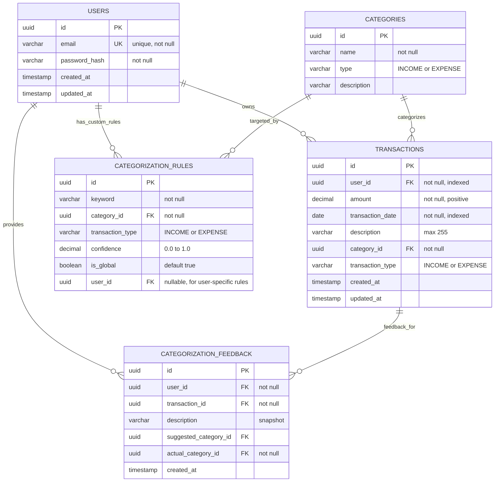

# Database Schema

## Entity Relationship Diagram



## Flyway Migration Scripts

### V1__initial_schema.sql

```sql
-- Create users table
CREATE TABLE users (
    id UUID PRIMARY KEY DEFAULT gen_random_uuid(),
    email VARCHAR(255) NOT NULL UNIQUE,
    password_hash VARCHAR(255) NOT NULL,
    created_at TIMESTAMP NOT NULL DEFAULT CURRENT_TIMESTAMP,
    updated_at TIMESTAMP NOT NULL DEFAULT CURRENT_TIMESTAMP
);

CREATE INDEX idx_users_email ON users(email);

-- Create categories table
CREATE TABLE categories (
    id UUID PRIMARY KEY DEFAULT gen_random_uuid(),
    name VARCHAR(100) NOT NULL,
    type VARCHAR(20) NOT NULL CHECK (type IN ('INCOME', 'EXPENSE')),
    description VARCHAR(500)
);

CREATE INDEX idx_categories_type ON categories(type);

-- Create transactions table
CREATE TABLE transactions (
    id UUID PRIMARY KEY DEFAULT gen_random_uuid(),
    user_id UUID NOT NULL REFERENCES users(id) ON DELETE CASCADE,
    amount DECIMAL(15, 2) NOT NULL CHECK (amount > 0),
    transaction_date DATE NOT NULL,
    description VARCHAR(255) NOT NULL,
    category_id UUID NOT NULL REFERENCES categories(id),
    transaction_type VARCHAR(20) NOT NULL CHECK (transaction_type IN ('INCOME', 'EXPENSE')),
    created_at TIMESTAMP NOT NULL DEFAULT CURRENT_TIMESTAMP,
    updated_at TIMESTAMP NOT NULL DEFAULT CURRENT_TIMESTAMP
);

CREATE INDEX idx_transactions_user_id ON transactions(user_id);
CREATE INDEX idx_transactions_date ON transactions(transaction_date);
CREATE INDEX idx_transactions_category_id ON transactions(category_id);
CREATE INDEX idx_transactions_type ON transactions(transaction_type);
```

### V2__seed_categories.sql

```sql
-- Seed income categories
INSERT INTO categories (id, name, type, description) VALUES
    (gen_random_uuid(), 'Salary', 'INCOME', 'Regular employment income'),
    (gen_random_uuid(), 'Freelance', 'INCOME', 'Freelance or contract work'),
    (gen_random_uuid(), 'Investments', 'INCOME', 'Investment returns, dividends'),
    (gen_random_uuid(), 'Other Income', 'INCOME', 'Other sources of income');

-- Seed expense categories
INSERT INTO categories (id, name, type, description) VALUES
    (gen_random_uuid(), 'Rent', 'EXPENSE', 'Housing rent or mortgage'),
    (gen_random_uuid(), 'Food', 'EXPENSE', 'Groceries and dining'),
    (gen_random_uuid(), 'Transport', 'EXPENSE', 'Transportation costs (gas, transit, uber)'),
    (gen_random_uuid(), 'Entertainment', 'EXPENSE', 'Movies, games, hobbies'),
    (gen_random_uuid(), 'Utilities', 'EXPENSE', 'Electricity, water, internet, phone'),
    (gen_random_uuid(), 'Healthcare', 'EXPENSE', 'Medical expenses, insurance'),
    (gen_random_uuid(), 'Shopping', 'EXPENSE', 'Clothing, electronics, general shopping'),
    (gen_random_uuid(), 'Savings', 'EXPENSE', 'Transfers to savings accounts'),
    (gen_random_uuid(), 'Other Expense', 'EXPENSE', 'Miscellaneous expenses');
```

### V3__categorization_tables.sql

```sql
-- Create categorization rules table (for AI suggestions)
CREATE TABLE categorization_rules (
    id UUID PRIMARY KEY DEFAULT gen_random_uuid(),
    keyword VARCHAR(255) NOT NULL,
    category_id UUID NOT NULL REFERENCES categories(id),
    transaction_type VARCHAR(20) NOT NULL CHECK (transaction_type IN ('INCOME', 'EXPENSE')),
    confidence DECIMAL(3, 2) NOT NULL CHECK (confidence BETWEEN 0.00 AND 1.00),
    is_global BOOLEAN NOT NULL DEFAULT TRUE,
    user_id UUID REFERENCES users(id) ON DELETE CASCADE
);

CREATE INDEX idx_categorization_rules_keyword ON categorization_rules(keyword);
CREATE INDEX idx_categorization_rules_user_id ON categorization_rules(user_id);
CREATE INDEX idx_categorization_rules_global ON categorization_rules(is_global);

-- Create categorization feedback table (user corrections for learning)
CREATE TABLE categorization_feedback (
    id UUID PRIMARY KEY DEFAULT gen_random_uuid(),
    user_id UUID NOT NULL REFERENCES users(id) ON DELETE CASCADE,
    transaction_id UUID NOT NULL REFERENCES transactions(id) ON DELETE CASCADE,
    description VARCHAR(255) NOT NULL,
    suggested_category_id UUID REFERENCES categories(id),
    actual_category_id UUID NOT NULL REFERENCES categories(id),
    created_at TIMESTAMP NOT NULL DEFAULT CURRENT_TIMESTAMP
);

CREATE INDEX idx_feedback_user_id ON categorization_feedback(user_id);
CREATE INDEX idx_feedback_transaction_id ON categorization_feedback(transaction_id);
CREATE INDEX idx_feedback_description ON categorization_feedback(description);

-- Seed initial global categorization rules
INSERT INTO categorization_rules (keyword, category_id, transaction_type, confidence, is_global)
SELECT 'starbucks', id, 'EXPENSE', 0.85, TRUE FROM categories WHERE name = 'Food';
INSERT INTO categorization_rules (keyword, category_id, transaction_type, confidence, is_global)
SELECT 'grocery', id, 'EXPENSE', 0.90, TRUE FROM categories WHERE name = 'Food';
INSERT INTO categorization_rules (keyword, category_id, transaction_type, confidence, is_global)
SELECT 'uber', id, 'EXPENSE', 0.85, TRUE FROM categories WHERE name = 'Transport';
INSERT INTO categorization_rules (keyword, category_id, transaction_type, confidence, is_global)
SELECT 'netflix', id, 'EXPENSE', 0.90, TRUE FROM categories WHERE name = 'Entertainment';
INSERT INTO categorization_rules (keyword, category_id, transaction_type, confidence, is_global)
SELECT 'salary', id, 'INCOME', 0.95, TRUE FROM categories WHERE name = 'Salary';
INSERT INTO categorization_rules (keyword, category_id, transaction_type, confidence, is_global)
SELECT 'paycheck', id, 'INCOME', 0.95, TRUE FROM categories WHERE name = 'Salary';
```
