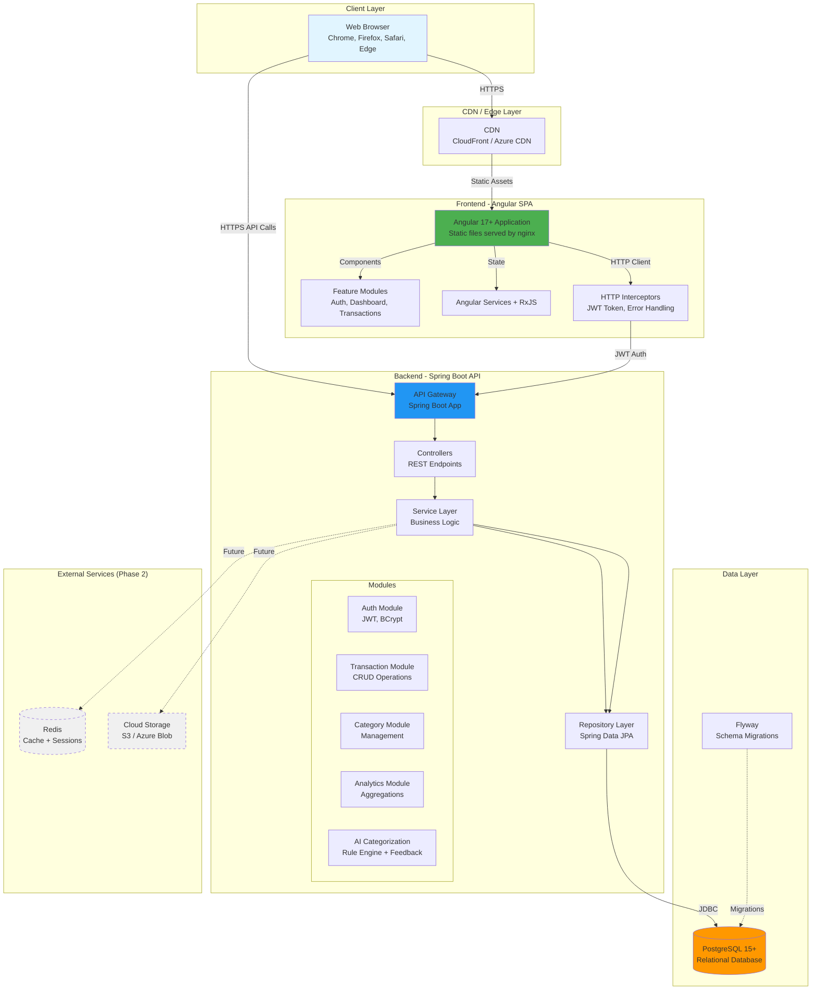

# High-Level Architecture

## Technical Summary

The Smart Budget App employs a **traditional client-server architecture** with an Angular 17+ Single Page Application (SPA) frontend communicating with a Spring Boot 3.x REST API backend. The frontend is deployed as static files served by nginx, while the backend runs as a containerized Java application. Both tiers communicate over HTTPS with JWT-based stateless authentication. The application uses PostgreSQL 15+ as the primary data store with Flyway for schema versioning. The entire stack is containerized using Docker, with Docker Compose orchestrating local development (frontend, backend, database). CI/CD is handled through GitHub Actions, automating testing, building, and deployment to cloud infrastructure (AWS/Azure/GCP - to be determined based on cost and requirements). This architecture achieves the PRD goals of rapid development (BMAD methodology), security (JWT auth, encrypted data), scalability (stateless API, horizontal scaling potential), and maintainability (clear separation of concerns, automated testing).

## Platform and Infrastructure Choice

After evaluating several options, the recommended platform is:

**Platform:** Cloud-agnostic with Docker containers (deployable to AWS, Azure, or GCP)

**Key Services:**
- **Compute:** Container hosting (AWS ECS/Fargate, Azure Container Instances, or GCP Cloud Run)
- **Database:** Managed PostgreSQL (AWS RDS, Azure Database for PostgreSQL, or GCP Cloud SQL)
- **Storage:** Cloud object storage for future file uploads (AWS S3, Azure Blob, or GCP Cloud Storage) - Phase 2
- **CDN:** CloudFront (AWS), Azure CDN, or Cloud CDN (GCP) for frontend static assets
- **Secrets Management:** AWS Secrets Manager, Azure Key Vault, or GCP Secret Manager
- **Monitoring:** Cloud-native monitoring (CloudWatch, Azure Monitor, or Cloud Monitoring)

**Deployment Host and Regions:**
- **MVP:** Single region deployment (US-East for lower latency to target users)
- **Phase 2:** Multi-region consideration for disaster recovery

**Rationale:**
- **Cloud-agnostic:** Avoid vendor lock-in by using Docker containers and standard PostgreSQL
- **Managed services:** Reduce operational overhead (managed database, auto-scaling containers)
- **Cost-effective:** Start with free tiers and scale as needed
- **Modern tooling:** Leverage cloud-native CI/CD integration with GitHub Actions

## Repository Structure

**Structure:** Monorepo

**Monorepo Tool:** None (simple directory-based monorepo)

**Package Organization:**
- `frontend/` - Angular 17+ application (standalone directory)
- `backend/` - Spring Boot Java 21 application (standalone directory)
- `docs/` - BMAD documentation (PRD, architecture, specs)
- `.github/workflows/` - CI/CD pipelines for both applications
- `docker-compose.yml` - Local development orchestration

**Rationale:**
- Simple monorepo structure without additional tooling complexity (no Nx, Turborepo needed for this scope)
- Shared version control and coordinated releases
- Single CI/CD pipeline can build, test, and deploy both applications
- Developer convenience: single clone, single workspace

## High-Level Architecture Diagram

## Architectural Patterns

- **Client-Server Architecture:** Clear separation between frontend (Angular SPA) and backend (Spring Boot API) with REST as the communication protocol - _Rationale:_ Enables independent development, testing, and scaling of each tier; widely understood pattern with extensive tooling support

- **Layered Architecture (Backend):** Controller → Service → Repository pattern with clear separation of concerns - _Rationale:_ Promotes maintainability, testability (mock layers independently), and enforces business logic encapsulation in service layer

- **Component-Based UI (Frontend):** Reusable Angular components organized into feature modules with lazy loading - _Rationale:_ Improves code reusability, enables code splitting for faster initial load, and maintains clear feature boundaries

- **Repository Pattern:** Data access abstraction via Spring Data JPA repositories - _Rationale:_ Decouples business logic from data access implementation, enables easy testing with mocks, and provides consistent CRUD operations

- **Service Layer Pattern:** Business logic encapsulated in service classes with transaction management - _Rationale:_ Centralizes business rules, provides transaction boundaries, and prevents business logic leakage into controllers or repositories

- **Interceptor Pattern:** HTTP interceptors for cross-cutting concerns (authentication tokens, error handling, logging) - _Rationale:_ Avoids code duplication, provides centralized request/response modification, and separates cross-cutting concerns from business logic

- **DTO Pattern:** Separate Data Transfer Objects for API request/response to decouple API contracts from domain models - _Rationale:_ Prevents domain model exposure, allows API evolution without database changes, and provides clear API contracts

- **Stateless Authentication:** JWT tokens for authentication without server-side session storage - _Rationale:_ Enables horizontal scaling (no session affinity), reduces server memory usage, and simplifies deployment
