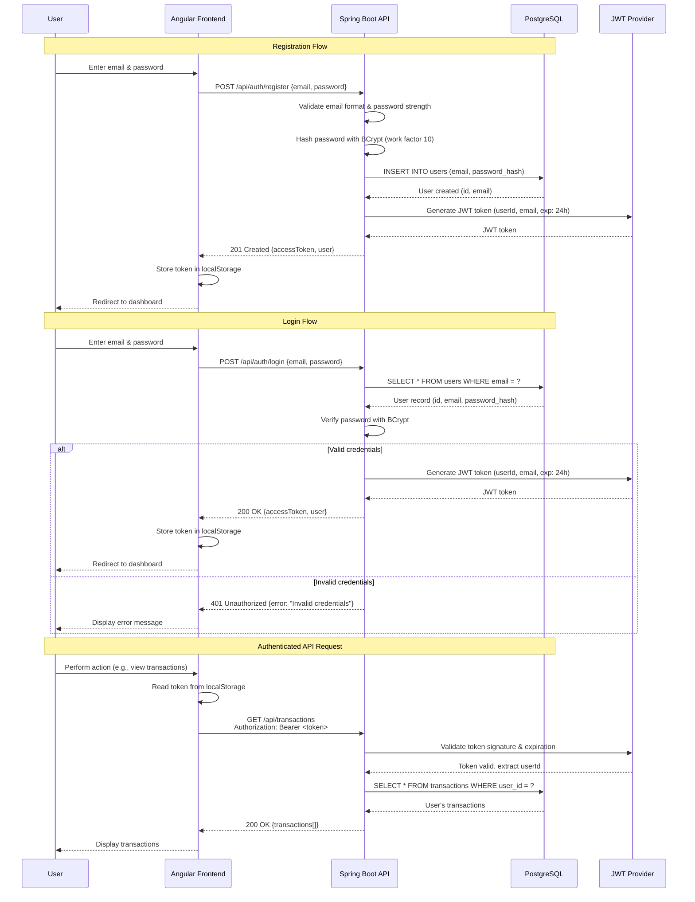

# Security Architecture

## Authentication Flow



## JWT Token Structure

```json
{
  "header": {
    "alg": "HS256",
    "typ": "JWT"
  },
  "payload": {
    "sub": "user-uuid-here",
    "email": "user@example.com",
    "iat": 1699564800,
    "exp": 1699651200
  },
  "signature": "..."
}
```

**Token Claims:**
- `sub` (Subject): User UUID
- `email`: User email address
- `iat` (Issued At): Token generation timestamp
- `exp` (Expiration): Token expiration (24 hours from `iat`)

## Security Measures

**Backend (Spring Boot):**
- **Password Hashing:** BCrypt with work factor 10 (configured in Spring Security)
- **JWT Signing:** HMAC-SHA256 with secret key from environment variable
- **CORS Configuration:** Whitelist frontend origin only (no wildcard `*`)
- **Input Validation:** Bean Validation (`@Valid`, `@NotNull`, `@Email`, etc.) on all request DTOs
- **SQL Injection Prevention:** Parameterized queries via JPA (no string concatenation)
- **Authorization:** All endpoints verify user ownership before returning/modifying data
- **HTTPS Enforcement:** All production traffic over TLS 1.2+
- **Security Headers:** Content-Security-Policy, X-Frame-Options, X-Content-Type-Options

**Frontend (Angular):**
- **Token Storage:** JWT stored in `localStorage` (XSS mitigation via Angular's built-in sanitization)
- **HTTP Interceptor:** Automatically attaches token to all outgoing requests
- **Error Interceptor:** Catches 401/403 responses, logs user out, redirects to login
- **Route Guards:** `AuthGuard` prevents access to protected routes without valid token
- **Input Sanitization:** Angular's DomSanitizer prevents XSS in dynamic content
- **CSP Headers:** Content-Security-Policy header blocks inline scripts
