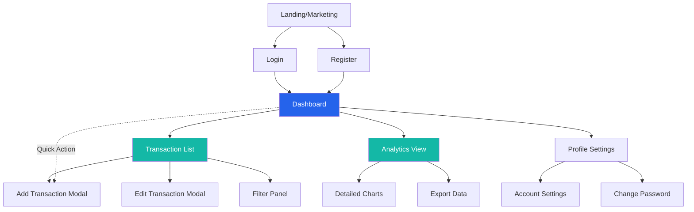
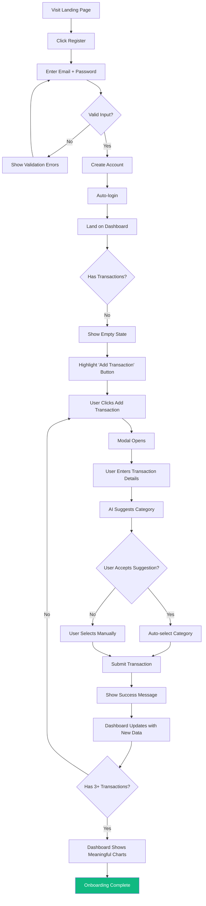
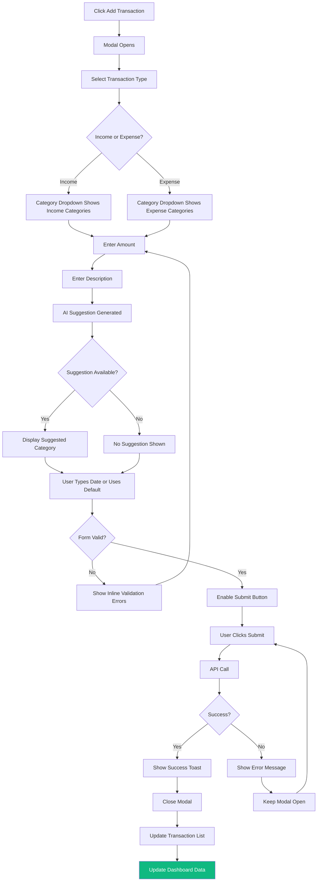
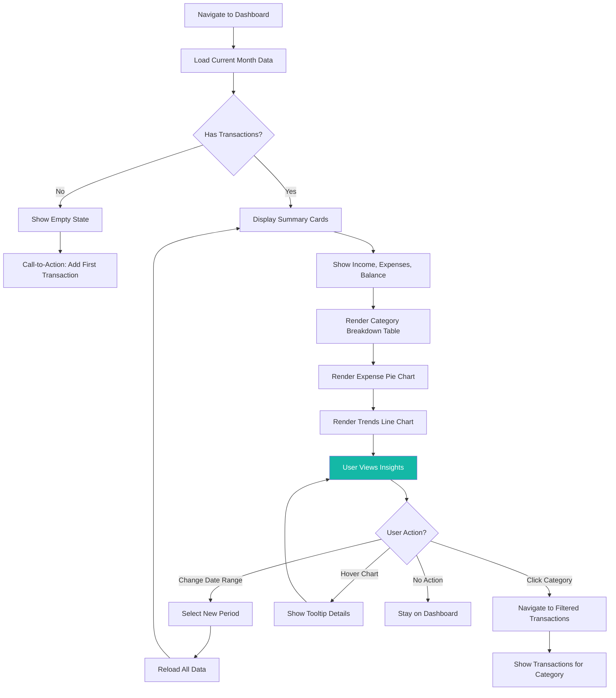
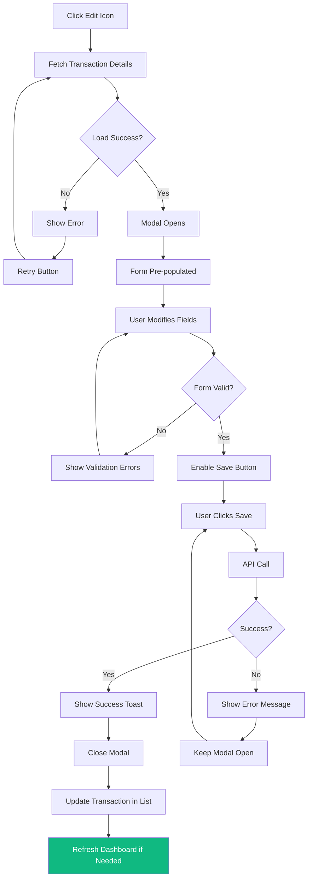
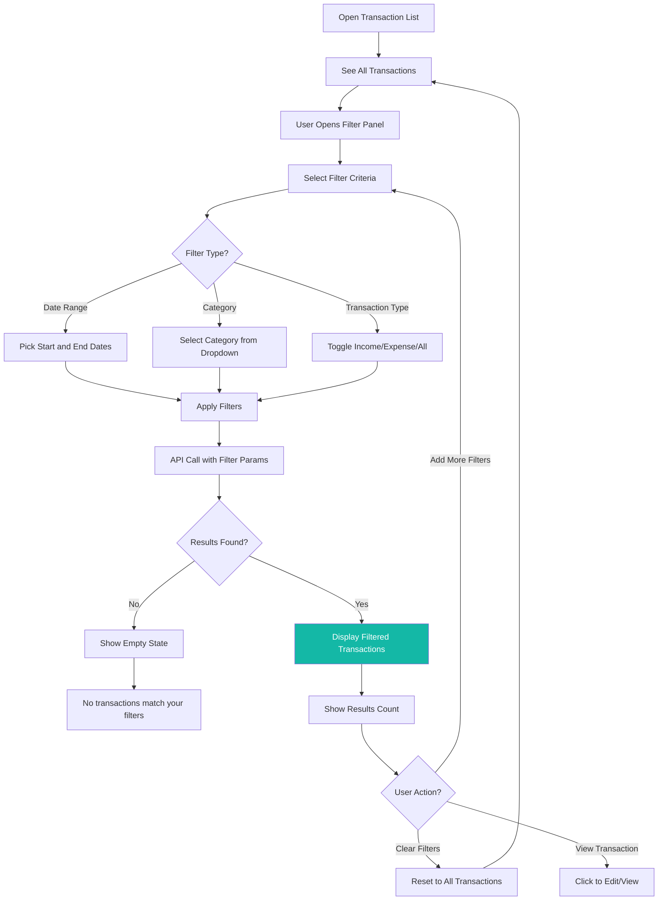

# Smart Budget App UI/UX Specification

## Introduction

This document defines the user experience goals, information architecture, user flows, and visual design specifications for Smart Budget App's user interface. It serves as the foundation for visual design and frontend development, ensuring a cohesive and user-centered experience.

### Overall UX Goals & Principles

#### Target User Personas

**Primary Persona: Budget-Conscious Young Professional (Sarah, 28)**
- **Background:** College-educated professional earning $50,000/year, lives in urban area
- **Tech Comfort:** High - uses mobile apps daily, comfortable with web applications
- **Financial Habits:** Sporadically tracks spending via banking app, tries various budgeting methods but struggles with consistency
- **Pain Points:** Doesn't understand where money goes each month, finds spreadsheets tedious, wants insights without becoming an accountant
- **Goals:** Build emergency fund, reduce unnecessary spending, achieve financial peace of mind
- **Preferred Interaction Style:** Quick, mobile-first, visual feedback, minimal data entry

**Secondary Persona: Household Budget Manager (Mark, 35)**
- **Background:** Manages family finances, household income $75,000/year
- **Tech Comfort:** Moderate - uses technology regularly but prefers simple interfaces
- **Financial Habits:** Tracks major expenses, uses cash and cards, needs to coordinate with partner
- **Pain Points:** Difficult to see complete household picture, categories don't match real spending patterns
- **Goals:** Keep household on budget, save for family goals (vacation, education)
- **Preferred Interaction Style:** Desktop-friendly, clear categorization, exportable data

#### Usability Goals

1. **Ease of Learning:** New users can add their first transaction and view insights within 2 minutes of account creation
2. **Efficiency of Use:** Power users can add a transaction in under 15 seconds using keyboard shortcuts and AI suggestions
3. **Error Prevention:** Clear validation, inline suggestions, and confirmation dialogs prevent accidental data loss or incorrect categorization
4. **Memorability:** Infrequent users can return after weeks away and immediately understand dashboard without reorientation
5. **User Satisfaction:** Clean, modern interface that feels empowering rather than overwhelming; users describe experience as "simple" and "helpful"

#### Design Principles

1. **Clarity Over Cleverness** - Every design decision prioritizes clear communication. Users should never have to guess what an action does or where to find information.

2. **Progressive Disclosure** - Show only what's essential upfront. Advanced features and details appear contextually when needed, keeping the interface clean.

3. **Immediate Feedback** - Every user action receives instant visual acknowledgment. Loading states, success confirmations, and errors appear immediately.

4. **Data Visualization First** - Numbers tell stories through charts. Prioritize visual representations over raw data tables to make insights accessible.

5. **Accessible by Default** - Design for keyboard navigation, screen readers, and varied abilities from the start, not as an afterthought.

### Change Log

| Date | Version | Description | Author |
|------|---------|-------------|--------|
| 2025-11-11 | 1.0 | Initial UI/UX specification created from PRD | Sally (UX Expert) |

## Information Architecture (IA)

### Site Map / Screen Inventory

**Screen Inventory:**
- **Public Screens:** Landing page (future), Login, Registration
- **Authenticated Screens:** Dashboard (home), Transaction List, Analytics View, Profile/Settings
- **Modal/Overlays:** Add Transaction, Edit Transaction, Delete Confirmation, Filter Panel, Date Range Picker

### Navigation Structure

**Primary Navigation:**
- Fixed top navigation bar (desktop) or hamburger menu (mobile)
- Logo/Brand (left side) links to Dashboard
- Main menu items: Dashboard, Transactions, Analytics, Profile
- Persistent "Add Transaction" floating action button (FAB) available on all screens for quick access
- Logout button in user menu (top right avatar/dropdown)

**Secondary Navigation:**
- Dashboard tabs/sections: Summary, Category Breakdown, Trends (all on single page with anchor scrolling on desktop)
- Transaction List: Inline filter chips and sort controls
- Analytics View: Chart type toggles (pie/bar/line), time period selector

**Breadcrumb Strategy:**
Not used - application is shallow with maximum 2 levels (Dashboard → specific view). Clear primary navigation and page titles provide sufficient wayfinding.

**Mobile Navigation:**
- Hamburger menu (☰) collapses primary navigation
- Bottom tab bar alternative consideration for key sections (Dashboard, Transactions, Add, Analytics, Profile)
- Swipe gestures for navigation between major sections (optional enhancement)

## User Flows

### Flow 1: First-Time User Onboarding

**User Goal:** Create account, add first few transactions, view initial insights to understand value proposition

**Entry Points:** Landing page → Register, or direct link to /register

**Success Criteria:** User has created account, added 3+ transactions, viewed dashboard with meaningful data

#### Flow Diagram

#### Edge Cases & Error Handling:

- Email already exists: Show clear error "This email is already registered. Try logging in instead." with link to login
- Weak password: Inline validation shows requirements (8+ characters) as user types
- Network failure during registration: Show retry button with error message
- API timeout: "Taking longer than expected. Please try again."
- User closes modal during transaction entry: Draft saved in session storage, restored if reopened within 5 minutes

**Notes:** Consider optional onboarding tooltip tour on first dashboard view highlighting: (1) Add Transaction button, (2) Dashboard summary cards, (3) Date range selector. Keep dismissible and non-blocking.

### Flow 2: Add Transaction

**User Goal:** Quickly record an income or expense transaction with minimal effort

**Entry Points:**
- Floating Action Button (FAB) available on any screen
- "Add Transaction" button on Transaction List page
- Empty state call-to-action on Dashboard

**Success Criteria:** Transaction successfully saved, appears in transaction list and updates dashboard summaries

#### Flow Diagram

#### Edge Cases & Error Handling:

- Invalid amount (negative, zero, text): Inline validation prevents submission
- Future date selected: Allow but show warning "This transaction is dated in the future"
- Description too long (>255 chars): Character counter shows remaining, prevents submission
- Network failure: "Could not save transaction. Please check your connection and try again." with retry button
- Duplicate transaction detection (optional enhancement): "Similar transaction found. Add anyway?" confirmation

**Notes:** Modal remains open after successful submission to allow quick entry of multiple transactions. "Add Another" vs "Done" buttons optional. Default behavior: close on success, stay open if user holds Shift key while clicking Submit.

### Flow 3: View Insights on Dashboard

**User Goal:** Understand spending patterns, identify top expense categories, see income vs. expenses trend

**Entry Points:** Login → Dashboard (default landing), or Primary navigation → Dashboard

**Success Criteria:** User views summary cards, understands category breakdown, interacts with charts

#### Flow Diagram

#### Edge Cases & Error Handling:

- No transactions in selected period: Empty state with message "No transactions found for this period. Try a different date range."
- Only income or only expenses: Charts adapt (pie chart shows "No expense data", trends chart shows single series)
- API failure loading data: Error state with retry button
- Slow network: Skeleton loading states for each card/chart section
- Date range with thousands of transactions: Paginate category breakdown, show top 10 with "View All" expansion

**Notes:** All dashboard components share the same date range selection state. Changing the date selector at top updates all cards/charts simultaneously with coordinated loading states.

### Flow 4: Edit Transaction

**User Goal:** Correct an error in a previously entered transaction (wrong amount, category, or description)

**Entry Points:** Transaction List → Click edit icon on specific transaction row

**Success Criteria:** Transaction successfully updated, changes reflected in transaction list and dashboard

#### Flow Diagram

#### Edge Cases & Error Handling:

- Transaction deleted by another session: 404 error shows "Transaction not found. It may have been deleted."
- Concurrent edit conflict (rare in single-user app): Last write wins, optional: show warning
- Network timeout: "Save failed. Please try again."
- Cancel button clicked: Confirmation dialog "Discard changes?" if form is dirty (modified)

**Notes:** Edit form reuses Add Transaction component in edit mode. AI suggestions not re-triggered during edit to avoid overriding user's intentional categorization.

### Flow 5: Filter and Search Transactions

**User Goal:** Find specific transactions or analyze spending in a particular category/timeframe

**Entry Points:** Transaction List page → Filter controls at top

**Success Criteria:** Transaction list updates to show only matching transactions, filter state visible and clearable

#### Flow Diagram

#### Edge Cases & Error Handling:

- Invalid date range (end before start): Validation prevents submission
- No transactions match filters: Clear message with "Clear Filters" button
- Multiple filters applied: Show active filter chips/tags, each removable individually
- Filter persistence: Filters reset when navigating away (don't persist in URL unless explicitly designed for sharing)

**Notes:** Consider adding search by description text (fuzzy match) in Phase 2. MVP focuses on structured filters (date, category, type).

## Wireframes & Mockups

**Primary Design Files:** To be created in Figma (link will be added when available)

For MVP, the following low-fidelity wireframe descriptions guide initial development. High-fidelity designs will be created in Figma for final visual approval.

### Key Screen Layouts

#### Login Screen

**Purpose:** Authenticate returning users securely

**Key Elements:**
- Centered card (max-width 400px) on neutral background
- Logo and app name at top
- Email input field (type="email", autocomplete enabled)
- Password input field (type="password", show/hide toggle icon)
- "Log In" primary button (full width, disabled until form valid)
- "Don't have an account? Register" link below button
- Inline validation errors below each field (red text, icon)
- "Forgot password?" link (future functionality, can be grayed out initially)

**Interaction Notes:**
- Enter key submits form if valid
- Focus states clearly visible on all inputs (blue outline)
- Loading spinner on button during API call, button text changes to "Logging in..."
- Error banner appears at top of card for authentication failures

**Design File Reference:** [Figma: Login Screen - to be added]

#### Registration Screen

**Purpose:** Create new user account

**Key Elements:**
- Similar layout to login screen (centered card)
- Email input field
- Password input field with strength indicator (weak/medium/strong)
- Confirm Password input field with matching validation
- Password requirements list (8+ characters, shown below password field)
- "Create Account" primary button
- "Already have an account? Log in" link
- Terms of service acceptance checkbox (future, optional for MVP)

**Interaction Notes:**
- Realtime password strength indicator updates as user types
- Confirm password shows green checkmark when matches, red X when doesn't
- Email uniqueness validated on blur (shows "Email already registered" if duplicate)
- Auto-login and redirect to Dashboard on successful registration

**Design File Reference:** [Figma: Registration Screen - to be added]

#### Dashboard (Main Landing Page)

**Purpose:** Provide at-a-glance financial overview and quick access to all key features

**Key Elements:**
- **Header Bar:** Logo (left), Date Range Selector (center), User Menu (right), Add Transaction FAB (bottom-right fixed position)
- **Summary Cards Row:** Three cards side-by-side (desktop) or stacked (mobile)
  - Income Card: Green accent, icon (arrow-up), large number, label
  - Expenses Card: Red accent, icon (arrow-down), large number, label
  - Balance Card: Blue/contextual color, icon (wallet), large number, label
- **Date Range Selector:** Dropdown with presets (This Month, Last Month, etc.) + Custom Range option
- **Category Breakdown Section:** Table with columns: Category, Amount, % of Total, Transaction Count
  - Progress bars visualizing percentage for each category
  - Click-to-filter interaction (navigate to Transaction List with filter applied)
- **Charts Section:** Two charts side-by-side (desktop) or stacked (mobile)
  - Left: Expense Pie Chart with legend
  - Right: Income vs. Expenses Line Chart (last 6 months)
- **Month Comparison Widget:** Small card showing vs. previous month with % changes and arrow indicators

**Interaction Notes:**
- Skeleton loading states for each section while data fetches
- Empty state when no transactions: Large icon, "No transactions yet", "Add your first transaction to see insights" with prominent Add button
- Hover effects on clickable elements (category rows, chart segments)
- Charts interactive: tooltip on hover, clickable segments (optional)
- Responsive: Cards stack on mobile, charts stack on tablet/mobile

**Design File Reference:** [Figma: Dashboard - to be added]

#### Transaction List View

**Purpose:** View, search, filter, and manage all transaction records

**Key Elements:**
- **Page Header:** "Transactions" title, Add Transaction button (top right)
- **Filter Bar:** Date range picker, Category multi-select dropdown, Type toggle (All/Income/Expense), "Clear Filters" button
- **Active Filters Display:** Chips/tags showing applied filters (each dismissible)
- **Results Count:** "Showing X of Y transactions"
- **Transaction Table:** Columns: Date, Description, Category, Amount, Type, Actions
  - Date: Formatted (e.g., "Jan 15, 2025")
  - Description: Left-aligned, truncated with tooltip if too long
  - Category: Badge/chip with color coding
  - Amount: Currency formatted, color-coded (green income, red expense)
  - Type: Icon (arrow-up/down) with text
  - Actions: Edit icon button, Delete icon button
- **Pagination Controls:** Page numbers or "Load More" button at bottom
- **Empty State:** "No transactions found" with filter guidance or add transaction CTA

**Interaction Notes:**
- Sortable columns (click header to sort by Date or Amount)
- Inline editing consideration for future (click row to expand edit form)
- Delete shows confirmation modal before executing
- Mobile: Table converts to card layout with all info stacked

**Design File Reference:** [Figma: Transaction List - to be added]

#### Add/Edit Transaction Modal

**Purpose:** Quick transaction entry or editing without leaving current page

**Key Elements:**
- **Modal Overlay:** Darkened background (alpha 50%)
- **Modal Card:** Centered, max-width 500px, white background, shadow
- **Modal Header:** "Add Transaction" or "Edit Transaction" title, Close button (X icon, top-right)
- **Form Fields:**
  - Transaction Type: Segmented control / toggle buttons (Income | Expense)
  - Amount: Number input, $ prefix, placeholder "0.00"
  - Date: Date picker input, defaults to today
  - Description: Text input, placeholder "e.g., Grocery shopping"
  - AI Suggestion: Small badge "Suggested: Food" (appears as user types, clickable to auto-select)
  - Category: Dropdown select, filtered by transaction type
- **Form Actions:** Cancel button (secondary), Save/Add button (primary, right-aligned)
- **Validation Messages:** Inline errors below each field (red text, icon)

**Interaction Notes:**
- Modal appears with slide-in-from-top animation (300ms)
- Close on backdrop click or Escape key
- AI suggestion debounced (500ms after user stops typing in description)
- Tab order: Type → Amount → Date → Description → Category → Save
- Keyboard shortcut: Cmd/Ctrl + Enter to submit
- Success: Toast notification "Transaction added successfully", modal closes

**Design File Reference:** [Figma: Transaction Modal - to be added]

#### Analytics/Charts View

**Purpose:** Deeper exploration of financial data with multiple chart types and comparisons

**Key Elements:**
- **Page Header:** "Analytics" title, Date Range Selector, Export button (future)
- **Chart Type Selector:** Tabs or segmented control (Overview | Category Breakdown | Trends | Comparison)
- **Large Chart Area:** Expanded versions of dashboard charts with more detail
- **Data Table:** Below charts showing raw numbers for accessibility and reference
- **Filters:** Similar to Transaction List (category, type, date range)
- **Insights Panel (future):** AI-generated insights like "You spent 20% more on Food this month"

**Interaction Notes:**
- Charts larger and more interactive than dashboard (zoom, pan for trends)
- Export to CSV/PDF buttons (Phase 2 feature, can be grayed out in MVP)
- Print-friendly layout
- Mobile: Charts stack vertically, data tables have horizontal scroll

**Design File Reference:** [Figma: Analytics View - to be added]

#### Profile/Settings Page

**Purpose:** Manage account information and preferences

**Key Elements:**
- **Page Header:** "Profile Settings" title
- **Sections:**
  - **Account Information:** Email (read-only or editable), Name (future), Profile Picture (future)
  - **Security:** Change Password form (Current Password, New Password, Confirm New Password)
  - **Preferences (future):** Default currency, Date format, Export options
  - **Danger Zone:** Delete Account button (red, with confirmation modal)
- **Save Button:** Primary button at bottom of each section

**Interaction Notes:**
- Change Password: Requires current password validation before allowing update
- Delete Account: Multi-step confirmation with "Type your email to confirm" safeguard
- Success/error toasts for all actions
- Mobile: Sections collapse into accordions

**Design File Reference:** [Figma: Settings Page - to be added]

## Component Library / Design System

### Design System Approach

**Recommendation: Angular Material with Tailwind CSS**

After evaluating both options against the Smart Budget App's requirements:

**Why Angular Material:**
✅ Official Angular integration with strong TypeScript support
✅ Comprehensive component library (Date Pickers, Dialogs, Tables, Form Controls)
✅ Built-in accessibility (WCAG AA compliant out-of-the-box)
✅ Mature theming system for brand customization
✅ Reduces custom component development time for MVP

**Why Add Tailwind CSS:**
✅ Utility-first CSS for rapid custom styling
✅ Excellent for responsive design and spacing utilities
✅ Complements Angular Material (use Material for complex components, Tailwind for layouts and custom elements)
✅ Smaller bundle size for custom components vs. full Material theme
✅ Modern development experience with JIT compilation

**Combined Approach:**
- Use **Angular Material** for: Buttons, Form fields, Date pickers, Dialogs/Modals, Tables, Menus, Progress indicators
- Use **Tailwind CSS** for: Layout grids, Spacing, Custom cards, Responsive utilities, Color customization beyond Material theme
- Customize Material theme to match brand colors (primary blue #2563EB, accent teal #14B8A6)

**Alternative (Not Recommended for MVP):** Pure Tailwind CSS with headlessUI or custom components would offer maximum flexibility but significantly increase development time and accessibility compliance effort.

### Core Components

#### Button Component

**Purpose:** Primary interaction element for actions throughout the application

**Variants:**
- Primary (filled, blue background): Main CTAs like "Save", "Add Transaction", "Log In"
- Secondary (outlined, blue border): Secondary actions like "Cancel", "Back"
- Tertiary (text only): Low-emphasis actions like "Skip", "Clear Filters"
- Danger (red background): Destructive actions like "Delete", "Remove"

**States:**
- Default: Base styling per variant
- Hover: Slightly darker shade, subtle scale transform (1.02)
- Active/Pressed: Darker shade, scale down slightly (0.98)
- Focus: Blue outline (2px, 2px offset) for keyboard navigation visibility
- Disabled: 50% opacity, cursor not-allowed, no hover effects
- Loading: Spinner icon replaces text, button disabled

**Usage Guidelines:**
- Use only one primary button per screen section
- Button text should be action-oriented verbs ("Add", "Save", "Delete")
- Include icon for clarity when space allows (e.g., trash icon for delete)
- Minimum touch target: 44x44px (mobile accessibility)
- Full-width buttons on mobile, auto-width on desktop

**Implementation:** `<button mat-raised-button color="primary">` (Angular Material) with custom Tailwind classes for spacing

#### Input Field Component

**Purpose:** Text, number, and date input for forms

**Variants:**
- Text Input: Standard text entry
- Number Input: Amount entry with currency formatting
- Email Input: Email validation and keyboard hint
- Password Input: Masked entry with show/hide toggle
- Date Input: Material Date Picker integration
- Select Dropdown: Category and filter selections
- Textarea: Description input (future feature)

**States:**
- Empty: Placeholder text (gray), label floated
- Focused: Blue border (2px), label blue
- Filled: Black text, border gray
- Error: Red border, error message below, error icon
- Disabled: Gray background, cursor not-allowed
- Success: Green border with checkmark (for confirm password matching)

**Usage Guidelines:**
- Always pair with label (for accessibility)
- Error messages appear below field, not as placeholder
- Use helper text for format guidance (e.g., "MM/DD/YYYY")
- Autocomplete attributes for browser autofill support
- Tab order follows visual layout

**Implementation:** `<mat-form-field>` with Tailwind spacing utilities

#### Card Component

**Purpose:** Container for grouped content (summary cards, charts, lists)

**Variants:**
- Default: White background, subtle shadow, rounded corners (8px)
- Highlighted: Colored left border (4px) for emphasis
- Interactive: Hover shadow deepens, cursor pointer
- Loading: Skeleton version with pulsing animation

**States:**
- Default: Base styling
- Hover (interactive only): Shadow elevation increases
- Active: Slightly darker background
- Disabled: Reduced opacity

**Usage Guidelines:**
- 16px padding on mobile, 24px on desktop
- Title (H2/H3) at top with 16px bottom margin
- Actions (buttons, icons) in top-right corner
- Use for summary cards, chart containers, transaction cards
- Stack vertically on mobile with 16px gap

**Implementation:** Custom Tailwind classes: `bg-white rounded-lg shadow-md p-4 md:p-6`

#### Summary Card Component

**Purpose:** Display key metrics (Income, Expenses, Balance) on dashboard

**Variants:**
- Income Card: Green left border, green icon background
- Expense Card: Red left border, red icon background
- Balance Card: Blue left border, contextual icon color (green positive, red negative)

**States:**
- Loading: Skeleton with pulsing gray rectangles for icon and number
- Empty: Shows "$0.00" with muted styling
- Error: Shows error icon and "Failed to load" message

**Usage Guidelines:**
- Icon in left corner (24px circle with white icon)
- Label (small text, gray) below icon
- Large number (32px font) prominently displayed
- Change indicator optional (e.g., "+12% vs. last month")
- Responsive: Full width mobile, 1/3 width desktop

**Implementation:** Custom component extending Card with specific slots for icon, label, amount

#### Chart Component

**Purpose:** Visual data representation (Pie, Line, Bar charts)

**Variants:**
- Pie Chart: Category breakdown
- Line Chart: Trends over time
- Bar Chart: Month-over-month comparison

**States:**
- Loading: Skeleton chart outline with pulsing animation
- Empty: Centered message "No data available" with helpful text
- Error: Error icon and "Failed to load chart" with retry button
- Interactive: Tooltips on hover, clickable segments (optional)

**Usage Guidelines:**
- Include title above chart (H3)
- Legend positioned to right (desktop) or below (mobile)
- Minimum height: 300px (desktop), 250px (mobile)
- Responsive: Maintains aspect ratio, reduces detail on mobile
- Accessible: Provide data table alternative or ARIA labels with data summary

**Implementation:** ngx-charts or Chart.js with Angular wrapper, Tailwind for container styling

#### Table Component

**Purpose:** Display transaction list and category breakdowns

**Variants:**
- Default Table: Bordered rows, alternating row background
- Card Table (mobile): Each row becomes a card with stacked fields
- Sortable Table: Clickable headers with sort indicators

**States:**
- Default: Base styling
- Row Hover: Light blue background highlight
- Row Selected: Darker blue background (if selection enabled)
- Loading: Skeleton rows with pulsing animation
- Empty: "No transactions found" centered message

**Usage Guidelines:**
- Sticky header row on scroll
- Actions column on right (edit, delete icons)
- Mobile: Convert to cards with labels for each field
- Pagination or infinite scroll for large datasets
- Accessible: Proper table semantics, sortable columns keyboard accessible

**Implementation:** `<mat-table>` for desktop, custom card layout for mobile with Tailwind responsive classes

#### Modal/Dialog Component

**Purpose:** Overlay dialogs for forms, confirmations, alerts

**Variants:**
- Form Modal: Large (500px width) for Add/Edit Transaction
- Confirmation Modal: Small (400px) for Delete confirmations
- Alert Modal: Medium (450px) for notifications and errors

**States:**
- Entering: Slide-in from top with backdrop fade-in (300ms)
- Open: Full opacity, modal centered
- Exiting: Slide-out to top with backdrop fade-out (200ms)

**Usage Guidelines:**
- Close button (X) in top-right corner always present
- Close on backdrop click or Escape key
- Focus trap: Tab cycles within modal
- Primary action button on right, secondary on left
- Mobile: Full-screen modal on small screens (<640px)

**Implementation:** `<mat-dialog>` with custom Tailwind animations

#### Toast/Snackbar Component

**Purpose:** Brief notification messages for success, error, info

**Variants:**
- Success: Green background, checkmark icon, "Transaction added successfully"
- Error: Red background, error icon, "Failed to save. Please try again."
- Info: Blue background, info icon, "Filters cleared"
- Warning: Orange background, warning icon, future use

**States:**
- Entering: Slide up from bottom (200ms)
- Visible: Full opacity, auto-dismiss after 3 seconds
- Exiting: Fade out (150ms)

**Usage Guidelines:**
- Position: Bottom-center on mobile, bottom-right on desktop
- Max width: 400px
- Include dismiss button (X) for user control
- Queue multiple toasts vertically
- Keep message concise (1 sentence)

**Implementation:** `<mat-snack-bar>` with custom styling

## Branding & Style Guide

### Visual Identity

**Brand Guidelines:** Internal Smart Budget App brand guidelines (to be formalized)

**Brand Personality:** Professional yet approachable, trustworthy, modern, empowering

**Voice & Tone:**
- Clear and concise (avoid financial jargon)
- Encouraging and positive (avoid judgmental language about spending)
- Helpful and informative (provide context for insights)
- Conversational but professional

### Color Palette

| Color Type | Hex Code | Usage |
|-----------|----------|-------|
| Primary | #2563EB | Primary buttons, navigation highlights, links, focus states |
| Success/Income | #10B981 | Income indicators, positive balances, success messages, checkmarks |
| Warning/Expense | #EF4444 | Expense indicators, negative balances, delete buttons, error states |
| Neutral - 50 | #F9FAFB | Page backgrounds, card hover states |
| Neutral - 100 | #F3F4F6 | Input backgrounds, disabled states |
| Neutral - 200 | #E5E7EB | Borders, dividers |
| Neutral - 600 | #4B5563 | Secondary text |
| Neutral - 900 | #111827 | Primary text, headings |
| Accent | #14B8A6 | Secondary actions, highlights, progress bars, category badges |

**Color Usage Guidelines:**
- Use primary blue (#2563EB) sparingly for CTAs only
- Green (#10B981) always indicates income or positive outcomes
- Red (#EF4444) always indicates expenses or negative outcomes
- Maintain 4.5:1 contrast ratio for all text (WCAG AA)
- Use neutral grays for most text and backgrounds to reduce visual noise

### Typography

#### Font Families

- **Primary:** Inter (Google Fonts) - Modern, highly legible, excellent for UI
- **Secondary:** System font stack fallback: -apple-system, BlinkMacSystemFont, "Segoe UI", Roboto, "Helvetica Neue", Arial, sans-serif
- **Monospace:** 'Roboto Mono', Consolas, Monaco, 'Courier New', monospace (for currency amounts, future code examples)

**Font Loading:** Use font-display: swap to prevent FOIT (Flash of Invisible Text)

#### Type Scale

| Element | Size | Weight | Line Height | Usage |
|---------|------|--------|-------------|-------|
| H1 | 32px (2rem) | 700 (Bold) | 1.2 (38px) | Page titles (Dashboard, Transactions) |
| H2 | 24px (1.5rem) | 600 (Semibold) | 1.3 (31px) | Section headings (Category Breakdown, Charts) |
| H3 | 20px (1.25rem) | 600 (Semibold) | 1.4 (28px) | Card titles, subsection headings |
| Body | 16px (1rem) | 400 (Regular) | 1.5 (24px) | Standard text, form labels, table content |
| Small | 14px (0.875rem) | 400 (Regular) | 1.4 (20px) | Helper text, captions, metadata |
| Tiny | 12px (0.75rem) | 400 (Regular) | 1.3 (16px) | Footnotes, disclaimers |
| Large Number | 36px (2.25rem) | 700 (Bold) | 1.1 (40px) | Summary card amounts |

**Usage Guidelines:**
- Maintain type scale hierarchy consistently
- Body text minimum 16px for readability
- Heading levels should follow semantic HTML (H1 → H2 → H3, no skipping)
- Use weight variations (400/600/700) rather than multiple font families

### Iconography

**Icon Library:** Heroicons (MIT License, designed by Tailwind Labs)

**Rationale:** Heroicons provide a comprehensive, modern icon set with both outline and solid variants, perfect for our clean, minimalist design. Compatible with Tailwind CSS and easy to integrate.

**Icon Sizes:**
- Small: 16px (inline with text)
- Medium: 20px (buttons, form fields)
- Large: 24px (navigation, headers)
- Extra Large: 32px (summary card icons, empty states)

**Usage Guidelines:**
- Use outline variant for most UI elements (nav, buttons)
- Use solid variant for emphasis (active states, filled buttons)
- Maintain consistent stroke width (2px for outline icons)
- Icons should have labels or ARIA labels for accessibility
- Color icons to match context (green for income, red for expenses)

**Common Icons:**
- Arrow Up Circle: Income
- Arrow Down Circle: Expense
- Plus: Add transaction
- Pencil: Edit
- Trash: Delete
- Funnel: Filter
- Calendar: Date picker
- Chart Bar: Analytics
- Wallet: Balance
- User Circle: Profile

### Spacing & Layout

**Grid System:** 12-column grid (Bootstrap-style) with Tailwind's grid utilities

**Container Max-Widths:**
- Mobile: 100% (with 16px padding)
- Tablet: 768px
- Desktop: 1024px
- Wide: 1280px

**Spacing Scale:** Tailwind's default spacing scale (4px base unit)
- 1: 4px (tight inline spacing)
- 2: 8px (small gaps)
- 4: 16px (standard component padding, gaps)
- 6: 24px (section padding desktop)
- 8: 32px (large section spacing)
- 12: 48px (page section spacing)
- 16: 64px (hero section spacing)

**Usage Guidelines:**
- Use 16px (space-4) as default spacing between components
- Mobile: 16px horizontal padding, 8px vertical gaps
- Desktop: 24px horizontal padding, 16px vertical gaps
- Cards: 16px padding mobile, 24px desktop
- Maintain consistent rhythm with 8px base increments

## Accessibility Requirements

### Compliance Target

**Standard:** WCAG 2.1 Level AA

**Rationale:** Level AA provides a strong baseline for accessibility without the extensive requirements of AAA, balancing inclusive design with practical development constraints for MVP.

### Key Requirements

**Visual:**
- **Color contrast ratios:** All text meets 4.5:1 minimum (3:1 for large text 18px+). Test with tools like WebAIM Contrast Checker
- **Focus indicators:** Visible focus outline (2px blue #2563EB, 2px offset) on all interactive elements. Never remove outline without custom replacement
- **Text sizing:** Text can be resized up to 200% without loss of content or functionality. Use relative units (rem, em) not fixed pixels

**Interaction:**
- **Keyboard navigation:** All functionality accessible via keyboard. Tab order follows visual layout (left-to-right, top-to-bottom)
- **Screen reader support:** Semantic HTML (nav, main, header, footer, article), ARIA labels for icons and custom controls, meaningful alt text for charts
- **Touch targets:** Minimum 44x44px for all interactive elements (buttons, links, form fields) to accommodate touch input

**Content:**
- **Alternative text:** Charts include data table alternatives or ARIA-labeled summaries (e.g., "Pie chart showing expense breakdown: Food 35%, Rent 30%, Transport 20%, Other 15%")
- **Heading structure:** Logical heading hierarchy (single H1 per page, no skipped levels)
- **Form labels:** Every input has associated label element, error messages use aria-describedby

**Additional Requirements:**
- **Skip Links:** "Skip to main content" link for keyboard users (visible on focus)
- **Error Identification:** Form errors clearly identified with color, icon, and text (not color alone)
- **Motion Preferences:** Respect prefers-reduced-motion media query, reduce/disable animations for users who need it

### Testing Strategy

**Automated Testing:**
- Integrate axe-core or Pa11y in CI/CD pipeline to catch common issues
- Run automated accessibility audits on every PR

**Manual Testing:**
- Keyboard-only navigation testing for all critical flows (login, add transaction, view dashboard)
- Screen reader testing with NVDA (Windows) and VoiceOver (Mac/iOS) on key screens
- Color contrast verification with browser DevTools or WebAIM tools
- Zoom testing at 200% scale to ensure no content overflow

**User Testing:**
- Include users with disabilities in beta testing phase (target 2-3 users with varied needs)
- Gather feedback on usability with assistive technologies

**Compliance Checklist:**
- [ ] All images and icons have appropriate alt text or ARIA labels
- [ ] Color is not the sole indicator of information (use icons, text, patterns)
- [ ] Forms have proper labels and error messages
- [ ] Keyboard focus is always visible
- [ ] Heading levels follow logical hierarchy
- [ ] Interactive elements meet minimum size requirements (44x44px)
- [ ] Charts provide text alternatives

## Responsiveness Strategy

### Breakpoints

| Breakpoint | Min Width | Max Width | Target Devices |
|-----------|-----------|-----------|----------------|
| Mobile | 320px | 639px | iPhone SE, iPhone 12/13 mini, Android phones (portrait) |
| Tablet | 640px | 1023px | iPad, iPad Mini, large phones (landscape), small tablets |
| Desktop | 1024px | 1919px | Laptops, desktop monitors (standard HD/FHD) |
| Wide | 1920px | - | Large desktop monitors (FHD+, 2K, 4K) |

**Implementation:** Tailwind's default breakpoints with mobile-first approach

### Adaptation Patterns

**Layout Changes:**
- **Mobile (320-639px):**
  - Single column layout for all content
  - Summary cards stack vertically with full width
  - Charts stack vertically (pie chart above trends chart)
  - Category breakdown shows top 5 with "View All" expansion
  - Navigation collapses to hamburger menu

- **Tablet (640-1023px):**
  - Two-column layout where appropriate (summary cards 2-across)
  - Charts remain stacked or 2-column depending on complexity
  - Transaction table shows fewer columns, hide less critical data (show on row expand)

- **Desktop (1024px+):**
  - Multi-column layouts (3 summary cards across, 2 charts side-by-side)
  - Full transaction table with all columns visible
  - Sidebar navigation or expanded horizontal nav

- **Wide (1920px+):**
  - Max-width container (1280px) to prevent overly wide layouts
  - Increased whitespace on sides
  - Optional: Dashboard widgets in 4-column grid

**Navigation Changes:**
- **Mobile:** Hamburger menu (☰) with drawer overlay, Bottom tab bar consideration for primary sections
- **Tablet:** Collapsible sidebar or top navigation with dropdowns
- **Desktop:** Fixed top navigation bar or persistent left sidebar

**Content Priority:**
- **Mobile:** Progressive disclosure - show summaries first, details on demand (accordions, tabs)
- **Desktop:** More information visible simultaneously, side-by-side comparisons

**Interaction Changes:**
- **Mobile:** Larger touch targets (44x44px minimum), swipe gestures for navigation
- **Desktop:** Hover states, tooltips, inline editing, keyboard shortcuts

**Image/Chart Adaptations:**
- **Mobile:** Simplified charts with fewer data points, legends below charts
- **Desktop:** Full detail charts with legends to the side, hover tooltips

## Animation & Micro-interactions

### Motion Principles

**Purpose-Driven Motion:** Every animation serves a purpose - guiding attention, providing feedback, or indicating state transitions. Avoid gratuitous animations.

**Performance First:** Animations must maintain 60fps. Use CSS transforms (translate, scale, opacity) which are GPU-accelerated. Avoid animating layout properties (width, height, top, left).

**Respectful of Preferences:** Honor prefers-reduced-motion media query. Reduce motion to simple fades or disable entirely for users who need it.

**Duration Guidelines:**
- Micro-interactions (button hover): 150-200ms
- UI transitions (modal open/close): 250-350ms
- Page transitions: 400-500ms max
- Loading indicators: Continuous (until content loads)

**Easing Functions:**
- Ease-out (cubic-bezier(0.0, 0, 0.2, 1)): Entering elements, modal opening
- Ease-in (cubic-bezier(0.4, 0, 1, 1)): Exiting elements, modal closing
- Ease-in-out (cubic-bezier(0.4, 0, 0.2, 1)): Transitions between states

### Key Animations

- **Button Hover:** Slight scale increase (scale: 1.02), background color darkens (100ms, ease-out)
- **Button Press:** Scale down (scale: 0.98), darker background (50ms, ease-in)
- **Modal Enter:** Slide down from top (translate Y: -20px to 0) + fade in (opacity 0 to 1), backdrop fade in (300ms, ease-out)
- **Modal Exit:** Slide up to top (translate Y: 0 to -20px) + fade out (opacity 1 to 0), backdrop fade out (200ms, ease-in)
- **Toast Notification Enter:** Slide up from bottom (translate Y: 20px to 0) + fade in (200ms, ease-out)
- **Toast Notification Exit:** Fade out (opacity 1 to 0) (150ms, ease-in)
- **Card Hover:** Shadow elevation increases (shadow-md to shadow-lg) (200ms, ease-out)
- **Loading Skeleton:** Pulse animation (opacity 1 to 0.5 to 1, continuous, 1.5s, ease-in-out)
- **Success Checkmark:** Scale in with bounce (scale: 0 to 1.1 to 1) (300ms, ease-out)
- **Error Shake:** Horizontal shake (translate X: -10px to 10px to 0, 3 cycles) (400ms, ease-in-out)
- **Number Count-Up:** Animate number value from 0 to target (1000ms, ease-out) for summary cards on initial load
- **Chart Entry:** Staggered fade-in for chart elements (bars, pie segments appear sequentially 50ms apart)

**Accessibility Note:** All animations wrap in `@media (prefers-reduced-motion: reduce)` query with simplified fade-only alternatives or no animation.

## Performance Considerations

### Performance Goals

- **Page Load:** First Contentful Paint (FCP) < 1.5s, Time to Interactive (TTI) < 3s on 3G connection
- **Interaction Response:** UI response to user input < 100ms (perceived as instant), API response reflected in UI < 200ms
- **Animation FPS:** Maintain 60fps for all animations (16.67ms per frame budget)

### Design Strategies

**Lazy Loading:**
- Load chart libraries (Chart.js, ngx-charts) only when dashboard/analytics routes accessed
- Defer loading of non-critical fonts (use font-display: swap)
- Implement virtual scrolling for transaction list if >100 items

**Optimistic UI Updates:**
- Add transaction: Immediately add to local list with temporary ID, update with real ID on API response
- Delete transaction: Immediately remove from list, roll back if API fails
- Edit transaction: Update local data immediately, revert on failure

**Skeleton Loading States:**
- Use CSS-only skeleton screens (no JavaScript) for initial render
- Skeleton layout matches final content layout (prevent layout shift)
- Pulse animation is GPU-accelerated (opacity change only)

**Image/Chart Optimization:**
- Use SVG for icons and simple graphics (scalable, small file size)
- Render charts with minimal data points on mobile (aggregate if >50 points)
- Defer chart rendering until visible on screen (Intersection Observer)

**Bundle Optimization:**
- Code splitting: Separate bundles for Auth, Dashboard, Transactions, Analytics routes
- Tree-shaking: Remove unused Angular Material components
- Compression: Enable gzip/brotli on server

**Critical CSS:**
- Inline critical CSS for above-fold content (header, summary cards on dashboard)
- Defer loading of non-critical styles

**Reduce Layout Shifts:**
- Reserve space for images and charts (aspect-ratio CSS property)
- Avoid injecting content above existing content
- Use consistent spacing throughout (Cumulative Layout Shift score < 0.1)

## Next Steps

### Immediate Actions

1. **Review and approve this UI/UX specification** with stakeholders and development team
2. **Create high-fidelity designs in Figma** based on wireframe descriptions and component specifications
3. **Set up design system in code** - Install Angular Material + Tailwind CSS, configure theme with brand colors
4. **Create component library storybook** (optional but recommended) for isolated component development and testing
5. **Handoff to Design Architect** to create frontend architecture document covering Angular module structure, state management, routing, and API integration
6. **Conduct design review session** with potential users (2-3 from target persona) to validate information architecture and key flows

### Design Handoff Checklist

- [x] All user flows documented (Onboarding, Add Transaction, View Insights, Edit, Filter)
- [x] Component inventory complete (Buttons, Inputs, Cards, Charts, Tables, Modals, Toasts)
- [x] Accessibility requirements defined (WCAG AA, keyboard nav, screen readers, color contrast)
- [x] Responsive strategy clear (Breakpoints, adaptation patterns for mobile/tablet/desktop)
- [x] Brand guidelines incorporated (Color palette, typography, iconography, spacing)
- [x] Performance goals established (Load time, interaction response, animation FPS)

### Figma Design File Structure (Recommended)

**Pages:**
1. **Cover Page** - Project overview, design principles, team
2. **Design Tokens** - Colors, typography, spacing, shadows (as Figma variables)
3. **Components** - Master component library (buttons, inputs, cards, etc.)
4. **Screens - Desktop** - All high-fidelity desktop screens
5. **Screens - Mobile** - All mobile responsive screens
6. **User Flows** - Flow diagrams with linked screens
7. **Prototypes** - Interactive prototypes for key journeys

### Design Review Questions

Before finalizing designs, answer these questions:
- Does the dashboard immediately communicate financial status to new users?
- Can users complete "Add Transaction" flow in under 20 seconds?
- Are error states and empty states helpful and encouraging (not frustrating)?
- Does the information architecture match users' mental models?
- Are the most frequent tasks (add transaction, view dashboard) easily accessible?
- Does the design feel trustworthy for handling financial data?

---

*UI/UX Specification Version 1.0 - Created 2025-11-11*
*Following BMAD Methodology Standards*
*Ready for high-fidelity design and frontend development*
